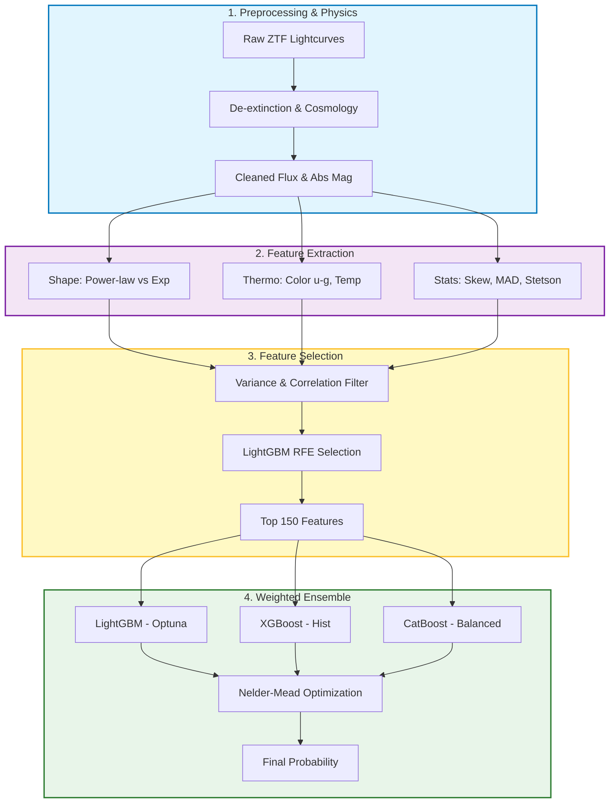

# Cuộc thi xây dựng hệ thống Mallorn Astronomical Classification

<div align="center">

[](https://www.kaggle.com/competitions/mallorn-astronomical-classification-challenge/overview)

[](#)

</div>
## 1. Tổng quan Dự án (Project Overview)

Dự án này tập trung giải quyết bài toán phân loại các sự kiện **Tidal Disruption Events (TDE)** - hiện tượng một ngôi sao bị hố đen siêu khối lượng xé nát - từ dữ liệu khảo sát thiên văn ZTF.

Đây là bài toán thách thức với dữ liệu chuỗi thời gian thưa thớt (sparse lightcurves), tỷ lệ mất cân bằng nghiêm trọng (**1:20**) và nhiễu nền cao. Phương pháp tiếp cận của chúng tôi là **"Theory-Guided Data Science"** (Khoa học dữ liệu dẫn đường bởi lý thuyết), kết hợp kiến thức vật lý thiên văn vào quy trình Feature Engineering và tối ưu hóa mô hình bằng học máy (Ensemble Learning).

---

## 2. Cấu trúc Thư mục (Repository Structure)
```
├── cleaned_data/                     # Dữ liệu sau khi đã tiền xử lý cơ bản
├── features_out_data_feature_selection/ # Chứa file train/test features đã qua chọn lọc (Input cho Model)
├── eda.ipynb                         # Phân tích khám phá dữ liệu (Exploratory Data Analysis)
├── preprocessing_data.ipynb          # Bước 1: Xử lý dữ liệu thô, khử Extinction, tính khoảng cách
├── feature_engineering.ipynb         # Bước 2: Trích xuất 150+ đặc trưng vật lý (Main Script)
├── model.ipynb                       # Bước 3 (V1): Huấn luyện Baseline LightGBM và (V2): Thử nghiệm với mô hình CatBoost
├── model_v2.ipynb                    # Bước 3 (V3 Final): Tối ưu hóa Ensemble (LGBM + XGB + Cat)
├── ve_tde_non_tde.ipynb              # Trực quan hóa so sánh Lightcurve TDE vs Non-TDE
└── README.md                         # Tài liệu dự án
```

---

## 3. Luồng xử lý (Pipeline Architecture)

Hệ thống được vận hành theo quy trình khép kín từ xử lý dữ liệu thô đến dự báo xác suất:

---

## 4. Đặc trưng Vật lý (Theory-Guided Features)

Hệ thống không sử dụng thống kê mù quáng mà trích xuất các đặc trưng dựa trên bản chất vật lý của TDE:

- **Năng lượng (Energetics):** `M_abs_u` (Độ sáng tuyệt đối cực tím) - Nhận diện sự kiện siêu sáng
- **Hình thái học (Morphology):** `r_skew_Flux`, `rise_rate` - Phân biệt dạng xung "Tăng nhanh - Giảm chậm" của TDE so với hình sin của sao biến quang
- **Nhiệt động học (Thermodynamics):** `color_g_r_max` - TDE duy trì nhiệt độ vật thể đen cao (màu xanh) ổn định, trong khi Supernova nguội dần (chuyển đỏ)

---

## 5. Quá trình Mô hình hóa & Kết quả

Nhóm đã trải qua 3 giai đoạn tối ưu hóa để đạt được kết quả cuối cùng:

| Phiên bản | Chiến lược | Public Score | OOF AUC | Ghi chú kỹ thuật |
|-----------|------------|--------------|---------|------------------|
| **V1** | Single LightGBM | 0.5684 | 0.8578 | Baseline tốt nhưng Variance cao, Recall thấp (58%) |
| **V2** | CatBoost | 0.5652 | - | Thất bại do trung bình cộng đơn giản làm giảm hiệu suất |
| **V3** | **Optimized Ensemble LGB + CatBoost + XGBoost** | **0.6004** | **0.9526** | **Thành công:** Tối ưu hóa trọng số bằng thuật toán Nelder-Mead |

### Cấu hình Ensemble V3 (Final)

Mô hình cuối cùng là sự kết hợp có trọng số của 3 thuật toán mạnh nhất:

- **CatBoost (53%):** Chủ đạo. Cấu hình `Auto-Balanced` và cây đối xứng giúp xử lý nhiễu vượt trội
- **XGBoost (26%):** Hỗ trợ. Sử dụng `tree_method='hist'` để ổn định hóa dự báo
- **LightGBM (21%):** Tấn công. Được tinh chỉnh Hyperparameter sâu bằng **Optuna**

---

## 6. Hướng dẫn Cài đặt & Chạy

### Yêu cầu hệ thống
```bash
Python 3.8+
```

### Thư viện cần thiết
```bash
pip install lightgbm catboost xgboost optuna scipy pandas numpy scikit-learn matplotlib seaborn
```

### Các bước thực thi

1. **Tiền xử lý:** Chạy `preprocessing_data.ipynb` để làm sạch dữ liệu thô
2. **Tạo đặc trưng:** Chạy `feature_engineering.ipynb`. Đây là bước tốn thời gian nhất để tạo ra 150 features
3. **Huấn luyện & Dự báo:** Chạy `model_v2.ipynb`. Script này sẽ:
   - Tự động chạy Cross-Validation
   - Tối ưu hóa tham số
   - Tìm trọng số Ensemble tối ưu
   - Xuất file `submission.csv`

---

## 7. Kết quả chính

- ✅ **Public Score:** 0.6004
- ✅ **OOF AUC:** 0.9526
- ✅ **Phương pháp:** Theory-Guided Feature Engineering + Optimized Ensemble
- ✅ **Điểm nổi bật:** Kết hợp kiến thức vật lý thiên văn với machine learning tiên tiến

## 8. Báo cáo chi tiết tại file Báo_Cáo_Bài_Tập_Lớn.pdf
